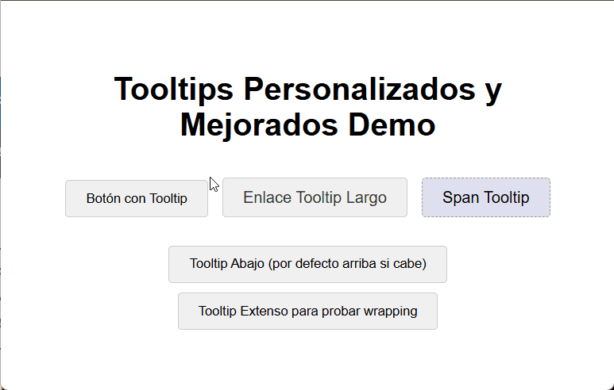

# customTooltip.js



**Lightweight JavaScript and CSS library to create stylish and customizable tooltips for your website.**

Enhance your website's user experience with visually appealing and informative tooltips. `customTooltip.js` provides a simple yet powerful way to replace default browser tooltips with custom-designed ones, improving both UX and UI.

## Demo

You can see a live demo by opening the `customTooltip.html` file in your browser. This file showcases different tooltip examples and how they appear on various elements.

## Installation & Usage

Integrate custom tooltips into your website in a few easy steps:

1.  **Include the CSS:** Add the `customTooltip.css` stylesheet to the `<head>` section of your HTML document.

    ```html
    <link rel="stylesheet" href="customTooltip.css">
    ```

    Ensure the path to `customTooltip.css` is correct relative to your HTML file.

2.  **Include the JavaScript:** Add the `customTooltip.js` script before the closing `</body>` tag of your HTML document.

    ```html
    <script src="customTooltip.js"></script>
    ```

    Make sure the path to `customTooltip.js` is also correct.

3.  **Add `data-tooltip` attribute:** To any HTML element where you want to display a custom tooltip, add the `data-tooltip` attribute and set its value to the tooltip text.

    ```html
    <button data-tooltip="This is a custom tooltip!">Hover over me</button>
    <a href="#" data-tooltip="A longer tooltip message.">Link with tooltip</a>
    <span data-tooltip="Tooltip on a span element.">Span element</span>
    ```

    That's all! Custom tooltips will now appear when users hover over elements with the `data-tooltip` attribute.

## Customization

The appearance of the tooltips is fully customizable through CSS by modifying the `customTooltip.css` file. Here are some key areas you can easily adjust:

*   **Basic Tooltip Styling (`.custom-tooltip` class):**
    *   `background-color`: Change the tooltip background color.
    *   `color`: Change the tooltip text color.
    *   `padding`: Adjust the spacing inside the tooltip.
    *   `border-radius`: Control the rounded corners of the tooltip.
    *   `font-size`: Set the tooltip text size.
    *   `box-shadow`: Customize the tooltip's shadow effect.
    *   `transition`: Modify the fade-in/fade-out animation speed and style.

*   **Arrow Styling (`.custom-tooltip::after`):** (Optional - if you use the arrow)
    *   `border-color`: Change the color of the tooltip arrow.
    *   `border-width`: Adjust the size of the arrow.
    *   `top`, `left`, `margin-left`, `margin-top`: Fine-tune the arrow's position and alignment.

*   **Arrow Position Classes (`.custom-tooltip.tooltip-arrow-top`, `.custom-tooltip.tooltip-arrow-bottom`):**
    *   These classes (applied automatically by the JavaScript when needed) allow you to style the arrow differently depending on whether the tooltip appears above or below the element. You can adjust the `top` and `border-color` properties within these classes.

**Example Customizations (in `customTooltip.css`):**

*   **Change colors and font:**

    ```css
    .custom-tooltip {
        background-color: #0056b3; /* Dark blue background */
        color: #fffde7; /* Light yellow text */
        font-family: 'Arial', sans-serif;
    }

    .custom-tooltip::after {
        border-color: #0056b3 transparent transparent transparent; /* Match arrow color to background */
    }
    ```

*   **Remove the arrow completely:**

    ```css
    .custom-tooltip::after {
        content: none; /* Hide the arrow */
    }
    ```

Experiment with these and other CSS properties to create tooltips that perfectly match your website's design and branding.

## Files Included

*   **`customTooltip.js`**: The JavaScript code responsible for creating, positioning, and showing/hiding the custom tooltips.
*   **`customTooltip.css`**: The CSS stylesheet that defines the visual appearance and animation of the tooltips.
*   **`customTooltip.html`**: A demo HTML file demonstrating various tooltip examples and usage.
*   **`demo-custom-tooltip.gif`**: An animated GIF showcasing the tooltips in action (like the one at the top of this README).

## Author

Jaime Paez

## License

This project is open-source and available under the [MIT License](LICENSE) (optional: you can add a LICENSE file and link it here). Feel free to use, modify, and distribute it as you wish.

## Contributing

Contributions are welcome! If you have suggestions for improvements, bug fixes, or new features, please feel free to:

1.  Fork the repository.
2.  Create a new branch for your feature or fix.
3.  Implement your changes and commit them.
4.  Submit a pull request.

---

**Enjoy using `customTooltip.js` to create beautiful and user-friendly tooltips on your website!**
